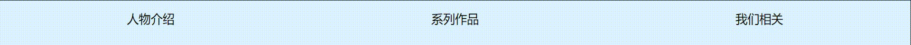
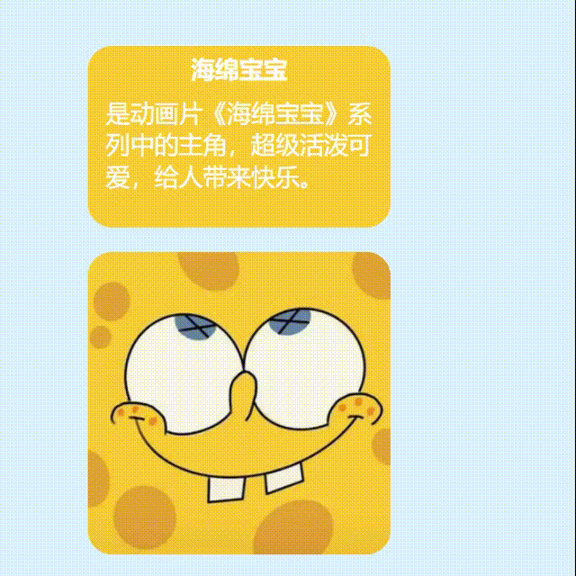
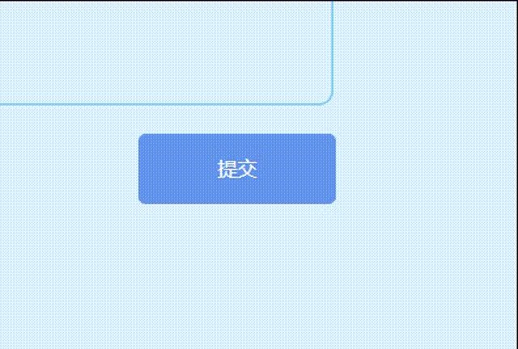

# 前端 第一轮考核

## 目的

HTML与CSS的基本语法

- HTML标签,标签的语义化（HTML5新特性）
- CSS 盒模型，利用 CSS 完成简单的布局 （水平/垂直居中的实现）
- CSS 定位，实现部分元素的绝对定位 
- 熟悉浏览器 F12 开发者工具的使用，利用它检查元素 
- 掌握简单的设计稿还原

## 任务

将设计图.png 文件还原成 HTML/CSS 文件（包括导航条、文字）

1. 通过自己的理解，将设计稿分解成合理的部件，网页布局合理
2. 使用**外联css**
3. 在人物介绍板块实现鼠标移入、移出效果
4. 导航栏应能点击跳转至相应位置
5. HTML/CSS 书写规范，命名规范
6. 不允许使用图形化工具制作界面

### 设计稿

### 移入移出效果

### 切图

### Bonus

1. 对效果的过渡效果进行优化（如渐变等）
2. 为不同的屏幕分辨率适配该页面，实现响应式布局

## 要求

1.  不要抄袭 
2.  不要抄袭
3.  不要抄袭
4.  当遇到不懂的地方时，首先要尝试自己解决，可以去使用百度、谷歌等**搜索引擎**寻求帮助。具备利用搜索引擎解决自己问题的能力非常非常重要。。

## 提示

设计图的背景颜色等可自行调整，主要考察布局（页面各个部分居中对齐），hover 效果，建
议 使用 flex 布局（不强制）

## 参考

