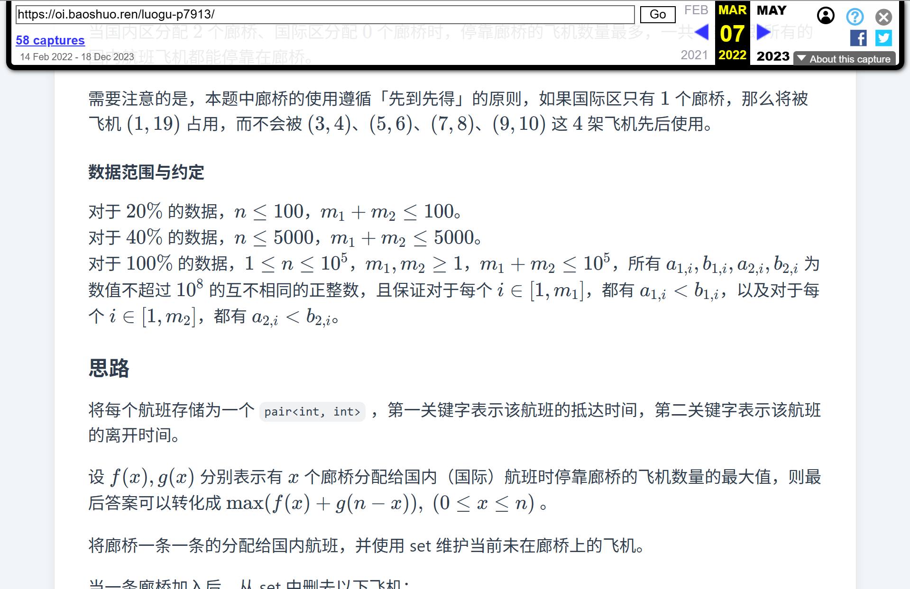

# 前端入门项目实战

## 学习目标

- 实现一个简单的前端入门项目
- 培养大前端思维
- 综合运用前几轮中所学的知识

## 常规项目：静态博客生成器

**目标**：使用 Node.js 实现一个静态博客生成器。<br />
**难度**：中等

### 功能要求

你的生成器需要能够处理指定目录下的 Markdown 文件，并输出一个结构完整的 `dist` 目录，其中包含可以被直接部署的 HTML, CSS 等静态资源。

### 页面结构

- **首页（文章列表页）**：`index.html`（`/page/{页码}/index.html`）
  - 集中展示所有博文的标题、摘要和发布日期。
    - 【**加分项** · 易】在前端结合一定的处理方式和 JavaScript 脚本实现发布日期显示的「X 天前」格式。
  - 博文列表必须按照 front-matter 中指定的 `date` 字段进行降序排列（即最新的文章在最前）。
    - 【**加分项** · 易】通过读取文件系统上的文件修改时间来确定文章最近的修改时间，并在文章列表和详情页中显示。
  - 文章数量过多时，应实现分页逻辑，每页展示固定数量（如 15 篇）的文章，并提供清晰的「上一页」「下一页」导航。
    - 【**加分项** · 中】实现跳转到首页、前后 X 页、末页的功能。<br />
      <br />
      如图中紫色框线框住的区域所示。<br />
      实现的时候需要注意窄屏设备的适配，确保在手机上也能正常使用。
- **文章详情页**：`/posts/{文件名}/index.html`
  - **URL 结构**：每篇文章应生成一个独立的目录，路径根据其 Markdown 源文件的文件名（不含扩展名）决定。例如，hello-world.md 将生成 /posts/hello-world/index.html。
  - **内容渲染**：
    - 标题：从 front-matter 中获取 `title` 字段。
    - 正文：将 Markdown 文件内容完整渲染为 HTML。
    - 元信息展示：页面上需要清晰地展示文章的发布日期（来自 front-matter）。
      - 【**加分项** · 易】通过读取文件系统上的文件修改时间来确定文章最近的修改时间，并在文章列表和详情页中显示。

### 技术要求

- 首页和文章详情页必须共享相同的页头（Header）和页脚（Footer）。你必须使用模板引擎或自定义的模板函数来实现布局复用，而不是在多个文件中复制粘贴 HTML 代码。
- 项目必须提供一个清晰的入口脚本（如 `build.js`），通过 `node build.js` 命令即可完成整个站点的构建过程。
- 你需要编写基础的 CSS 来美化你的博客。成品不要求设计感惊艳，但必须保证结构清晰、排版工整、阅读体验良好。<br />
  <br />
  
- 所有 Markdown 文件顶部可以包含 YAML front-matter 块，用于记录文章的元信息。请使用专门的解析库来解析这些 front-matter 数据，没有数据时可以使用文件名和文件系统上的文件元信息作为替代。<br />
  ```markdown
  ---
  title: "我的第一篇博客"
  date: "2025-07-20"
  ---

  这里是文章的正文内容...
  ```

### 技术选型提示

下面给出了一些推荐的技术选型，但你也可以根据自己的喜好选择其他工具。

- **Markdown 渲染器**
  - [marked](https://github.com/markedjs/marked)：一个快速、轻量级的 Markdown 解析和编译库。
  - [markdown-it](https://github.com/markdown-it/markdown-it)：功能强大且支持插件扩展，可以轻松实现代码高亮、TOC 等高级功能。
- front-matter 解析器
  - [gray-matter](https://github.com/jonschlinkert/gray-matter)
  - [parse-md](https://github.com/rpearce/parse-md)
- **模板引擎**
  - DIY 方案：你可以尝试自己用字符串拼接或模板字符串实现一个最简陋的模板函数，但这只推荐在项目初期用于理解原理。
  - 成熟方案（推荐）
    - [EJS](https://github.com/mde/ejs)：语法类似原生 HTML，学习成本低。
    - [Nunjucks](https://mozilla.github.io/nunjucks/)：功能强大，语法类似 Python 的 Jinja2，支持继承、宏等高级特性。

### 加分项

完成核心功能后，可以尝试实现以下加分项来提升项目的完整性和你的技术能力。

#### （简单）生成 Sitemap

- **目标**：在构建时自动生成 `sitemap.xml` 文件，这对于 SEO 非常重要。
- **实现**：遍历所有文章页面，将它们的 URL 列表按 Sitemap XML 格式写入文件。

#### （简单）数学公式支持

- **目标**：支持在 Markdown 中使用 LaTeX 语法编写数学公式。
- **实现**：可以使用 [KaTeX](https://katex.org/) 或 [MathJax](https://www.mathjax.org/) 来渲染数学公式。

#### （中等）TypeScript 支持

- **目标**：使用 TypeScript 编写整个项目，为文件 I/O、数据处理等环节提供类型约束，提升代码健壮性和开发体验。
- **实现**：可以使用 [ts-node](https://github.com/TypeStrong/ts-node#programmatic) 直接运行 .ts 脚本。

#### （中等）标签功能

- **目标**：解析 front-matter 中的 `tags` 字段，并为每个标签生成一个独立的列表页面（如 `/tags/Node.js/index.html`），展示所有包含该标签的文章。

#### （困难）纯前端搜索功能

- **目标**：实现一个无需后端的站内搜索功能。
- **实现思路**：在构建时，将所有文章的标题、标签和纯文本内容处理后，生成一个大的 `search.json` 文件。在前端，通过 `fetch` 加载此 JSON 文件，并使用 Lunr.js 或 Fuse.js 等库来实现高效的客户端搜索。

## 实践项目（根据当年情况决定）

根据考核年的实际情况，可能会有不同的实践项目。

## 提交要求

- **代码仓库**：提供一个公开的 GitHub 仓库地址。
- **清晰的 README.md**
  - 简要介绍你的项目，一两句话即可。
  - 提供明确的安装和运行步骤（如何安装依赖、如何执行构建脚本）。
- **准备答辩**：你需要能够清晰地向他人介绍你的项目架构、技术选型、实现思路以及遇到的挑战。
